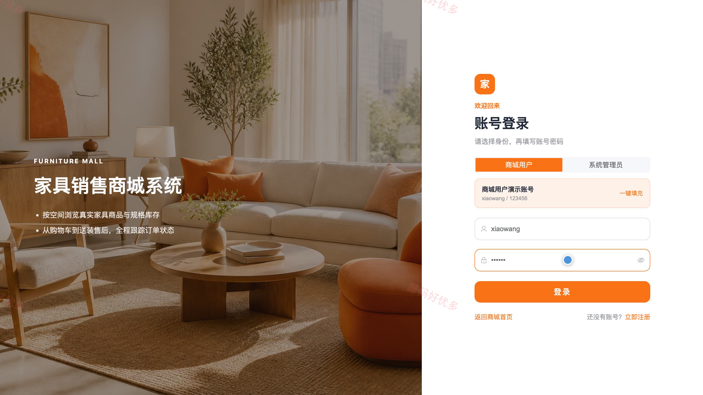
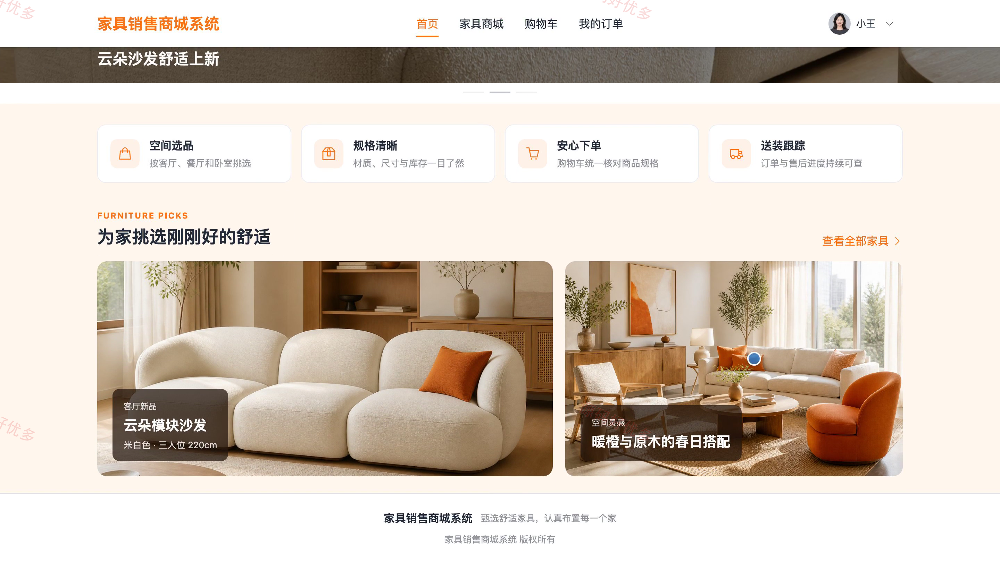
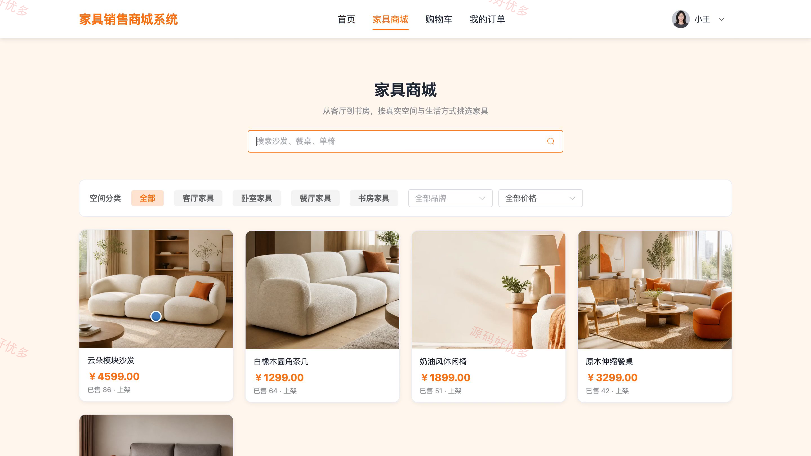
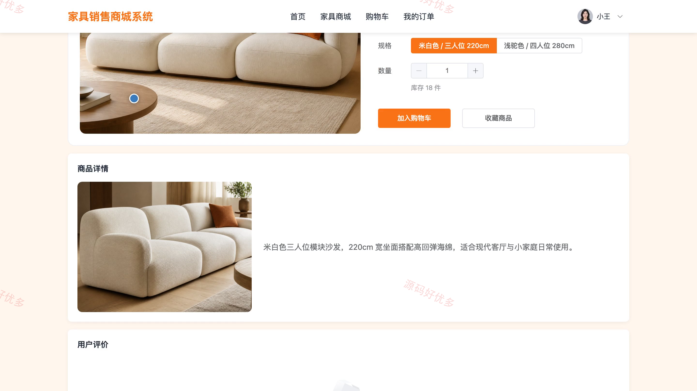
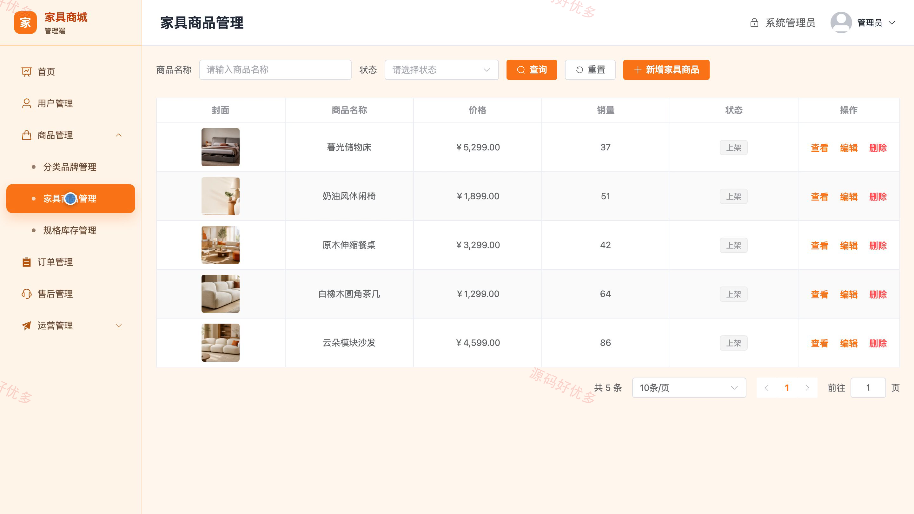
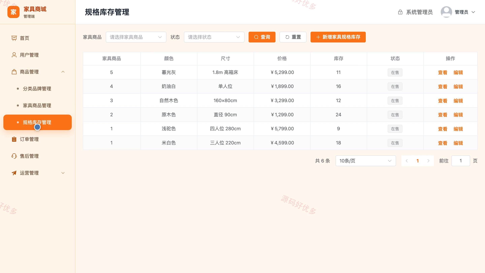
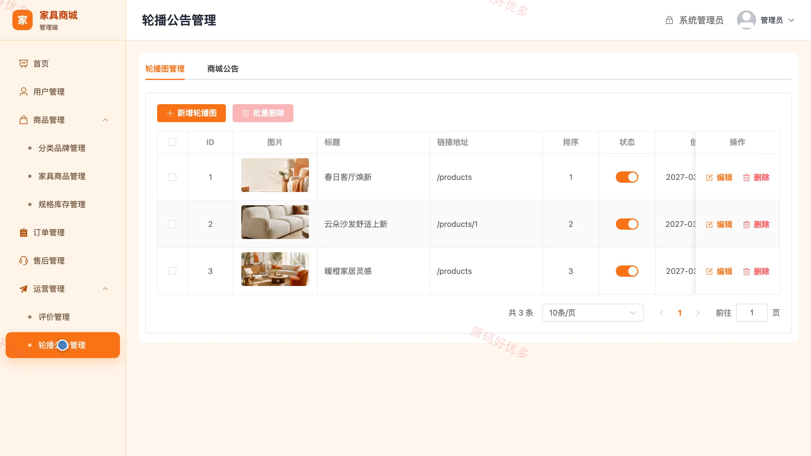

# bs066A
bs066A家具销售商城系统
## 源码问题查看主页咨询

### 一、关键词
家具销售商城、家居商城、家具选购、家居购物、家具网购

### 二、作品包含
源码+数据库+万字设计文档+PPT+全套环境和工具资源+本地部署教程

### 三、项目技术
前端技术： Html、Css、Js、Vue3.4、Element-Plus
后端技术：Java、SpringBoot3.2.0、MyBatis-Plus

### 四、运行环境（以下版本亲测，其他版本兼容性请自行测试）
开发工具：IDEA/eclipse + VSCODE

数据库：MySQL5.7+（共17张表）

数据库管理工具：Navicat10以上版本

环境配置软件： JDK17 + Maven

前端Nodejs：16+

浏览器：谷歌浏览器

### 五、项目介绍
项目编号：bs066A

家具销售商城系统面向商城用户和系统管理员，覆盖家具分类检索、规格库存选择、购物车结算、订单跟踪、评价售后以及商品与商城运营管理，形成从选购到售后的完整交易流程。

角色：商城用户、系统管理员

商城用户功能：注册登录、家具分类浏览与搜索筛选、商品详情与规格库存查看、商品收藏、购物车管理、收货地址管理、订单提交与状态跟踪、商品评价与售后申请。

系统管理员功能：商城经营数据看板、用户管理、家具分类与品牌管理、家具商品与上下架管理、商品规格与库存管理、订单确认与发货管理、售后审核与处理、评价及轮播公告管理。

### 六、运行截图

